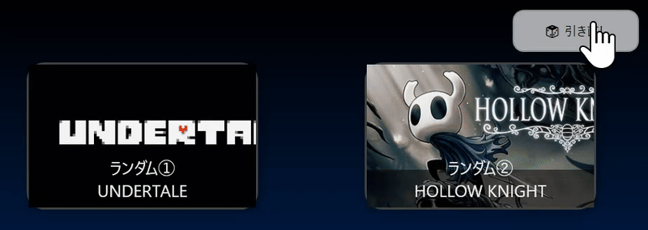
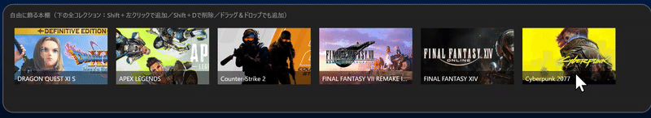
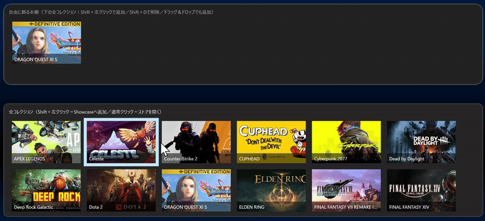

題材　Steam 本棚風アプリ
Steam ライブラリを “飾って楽しむ” ＋ “積みゲー可視化” デスクトップアプリ

コンセプト
近年「買ったけど遊べていないゲーム」が増えている、いわゆる“積みゲー問題”。
友人の「自分の積みゲーがどれくらいあるかわからない」という一言をきっかけに、
「積みゲーを楽しく見える化できるアプリ」 を制作しました。
🎯 Steam の所有ゲームを本棚のように並べて飾る「着飾り積みゲーアプリ」

主な機能
・本棚飾り機能　　　　　　　　Shift＋クリック／ドラッグ＆ドロップで追加・削除が可能
・ランダム積みゲー提案　　　　未プレイや短時間プレイのゲームを自動抽出
・JSONローカル保存　　　　　　Showcaseの構成をローカルに保持
・Steam API連携　　　　　　　所有ゲーム・プレイ時間を取得し、総プレイ1位を自動判定
・セキュリティ対策　　　　　　GitHubにはAPIキーを含まないダミーデータ版を公開

実行画面
(実行動画・GIFあり)

・ランダムで積みゲーを表示

・Shift + D で削除

・所有ゲームを本棚にドラッグ＆ドロップで飾り付け

・メイン画面

##  使用技術

| カテゴリ | 使用技術 |
|-----------|-----------|
| 言語 | C# (.NET 8) |
| フレームワーク | WPF |
| データ管理 | JSON ローカル保存 |
| API | Steam Web API（※ダミー版を公開） |
| バージョン管理 | Git / GitHub |

📁 フォルダ構成（抜粋）
GameSteemSh /
 ┣ Effects/
 ┃ ┗ StarField.cs
 ┣ Models/
 ┃ ┣ Game.cs
 ┃ ┗ Secrets.cs
 ┣ Services/
 ┃ ┣ IGameProvider.cs
 ┃ ┗ DummyGameProvider.cs
 ┣ MainWindow.xaml(.cs)
 ┗ App.xaml

 今後の改善・Vision
・プレイ履歴やジャンル傾向の分析・おすすめ生成
・Steam以外（PS / Nintendo）連携も視野に
・獲得トロフィーを飾れる「ルーム」機能
・機械学習や外部APIで「遊びのデータを価値に変える」体験へ
・本棚UIのデザイン・カスタマイズ性強化
・ユーザー同士のコミュニティ要素
・「積みゲーを積み上げて落とす」ミニゲーム構想

## 💪 学習スキル自己評価

| スキル | レベル | 備考 |
|:--------|:--------|:--------|
| **C#** | ★★★★☆ | オブジェクト指向理解を基盤に成長中 |
| **Unity** | ★★☆☆☆ | 3Dアニメ・リギングは今後の課題 |
| **HTML / CSS / JS** | ★★☆☆☆〜★★★☆☆ | Web技術も併学中 |
| **Java / AWS / Git** | ★☆☆☆〜★★☆☆ | 今後強化予定 |

学びと今後
UnityをきっかけにC#を学び始め、
開発を通じて “技術のつながりの面白さ” を実感しました。
ゲームだけでなく、サーバーやフロントエンドなど、
多様な技術が一つの作品を支えていることを理解し、
これからも新しい技術トレンドを素早くキャッチできるエンジニアを目指します。

備考
本リポジトリは ダミーデータ版（APIキー含まず）を公開しています。
実際のSteam連携版は、セキュリティを考慮して非公開環境で実行しています。
